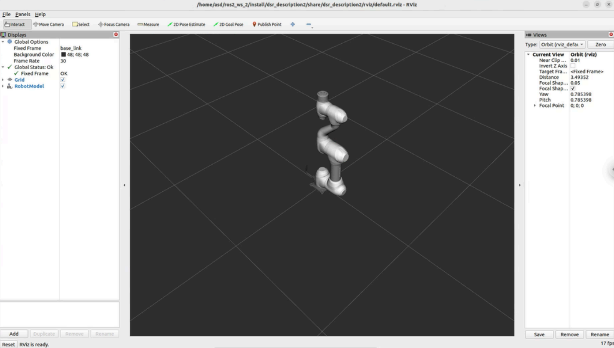

# <center>2. Start Simulation with Rviz2 </center>

<br/><br/>

# 1) Launch File

> doosan-robot2/dsr_bringup2/launch/<br/>
> > dsr_bringup2_gazebo.launch.py<br/>
> > dsr_bringup2_moveit.launch.py<br/>
> > dsr_bringup2_rviz.launch.py<br/>
> > dsr_bringup2_spawn_on_gazebo.launch.py<br/>


<br/><br/>

# 2) Check Input Arguments
Among the launch files, If you check the "dsr_bringup2_rviz.launch.py" file for visualizing the virtual robot,<br/>
you can configure the simulation environment using the following input arguments. <br/>

```python
def generate_launch_description():
    ARGUMENTS =[ 
        DeclareLaunchArgument('name',       default_value = 'dsr01',            description = 'NAME_SPACE'      ),
        DeclareLaunchArgument('host',       default_value = '127.0.0.1',        description = 'ROBOT_IP'        ),
        DeclareLaunchArgument('port',       default_value = '12345',            description = 'ROBOT_PORT'      ),
        DeclareLaunchArgument('mode',       default_value = 'virtual',          description = 'OPERATION MODE'  ),
        DeclareLaunchArgument('model',      default_value = 'm1013',            description = 'ROBOT_MODEL'     ),
        DeclareLaunchArgument('color',      default_value = 'white',            description = 'ROBOT_COLOR'     ),
        DeclareLaunchArgument('gui',        default_value = 'false',            description = 'Start RViz2'     ),
        DeclareLaunchArgument('gz',         default_value = 'false',            description = 'USE GAZEBO SIM'  ),
        DeclareLaunchArgument('rt_host',    default_value = '192.168.137.50',   description = 'ROBOT_RT_IP'     ),
    ]
```
<center>Input Arguments for "dsr_bringup2_rviz.launch.py"</center>

<br/><br/>

# 3) Initial Setup
Move to the workspace and configure the ROS2 environment.
``` bash
$ cd ~/ros2_ws # Default Working Directory
$ source /opt/ros/humble/local_setup.bash # Configure ROS 2 Environment
$ source install/setup.bash # User Workspace Environment
```


<br/><br/>

# 4) Running Launch File
Here is how to run the launch file.
```bash
$ ros2 launch [package_name] [launch_file_name] [arguments]
```


</br>

By entering the following command in the terminal, you can activate the virtual robot environment using RViz.<br/>
```bash
$ ros2 launch dsr_bringup2 dsr_bringup2_rviz.launch.py model:=m0609
```

<br/><br/>

# 5) Execution Result



<center>Result of running "dsr_bringup2_rviz.launch.py" (RViz)</center>
