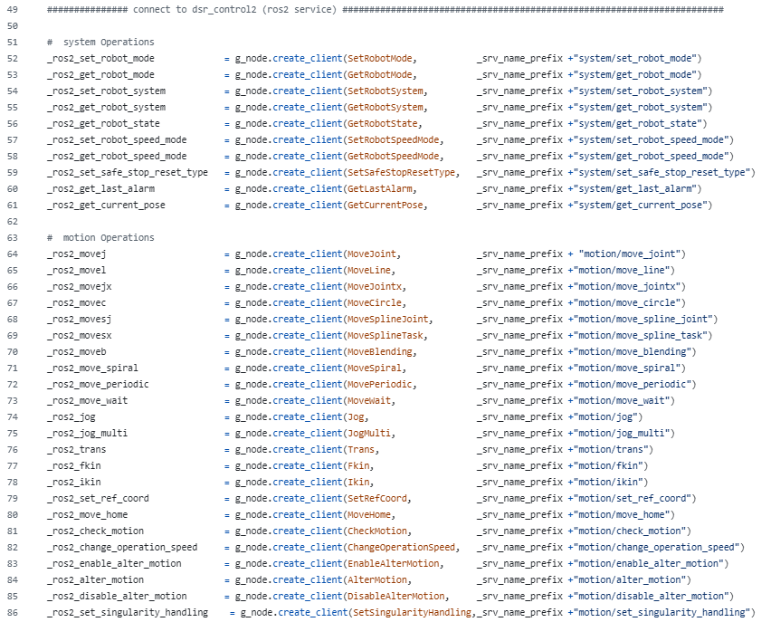
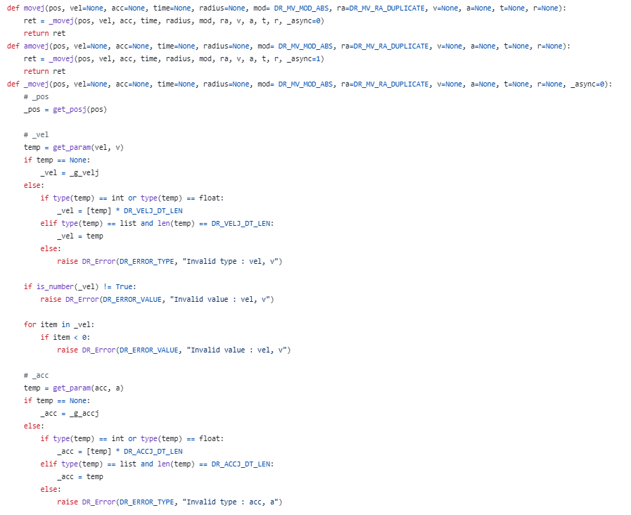
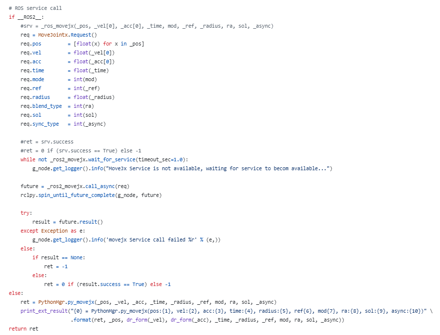

# <center>6. Appendix : Python Interface & CLI Example</center>


<br/>

## Table of Contents
1. Configuration of a Python Interface (common2/imp/DSR_ROBOT2.py)
2. Example Function (CLI Commands)


<br/>

## 1) Configuration of a Python Interface (common2/imp/DSR_ROBOT2.py)

In ROS2, service communication is used to send operation commands to a robot.<br/>
This service communication, implemented as a Python function, is called a Python interface.<br/>
The Python interface has a form similar to DRL (Doosan Robot Language).<br/>


<br/>

---

<center>Create Client</center>
<center>(common2/imp/DR_ROBOT2.py)</center>

<br/><br/>

---

<center>Motion Function Definition</center>
<center>(common2/imp/DR_ROBOT2.py)</center>

<br/><br/>

---

<center>Service Request within a Function</center>
<center>(common2/imp/DR_ROBOT2.py)</center>

<br/><br/><br/><br/>


Examples of some functions in the Python interface can be found in the file at the path below.<br/>
1.  doosan-robot2/dsr_example2/example/example/simple/single_robot_simple.py
2.  doosan-robot2/edu_example/edu_example/extra/test_function.py

<br/><br/><br/><br/>

## 2) Example Function (CLI Commands)


### JogMultiAxis (Topic)
```bash
ros2 topic pub --once /dsr01/jog_multi dsr_msgs2/msg/JogMultiAxis "{jog_axis: [1,0,0,0,0,0], move_reference: 0, speed: 20}"
ros2 topic pub --once /dsr01/jog_multi dsr_msgs2/msg/JogMultiAxis "{jog_axis: [-1,0,0,0,0,0], move_reference: 0, speed: 20}"
ros2 topic pub --once /dsr01/jog_multi dsr_msgs2/msg/JogMultiAxis "{jog_axis: [0,0,0,0,0,0], move_reference: 0, speed: 20}"
```

<br/>

### Kinematics
```bash
ros2 service call /dsr01/motion/fkin dsr_msgs2/srv/Fkin "{pos: [0,0,90,0,90,0]}" # j -> x
ros2 service call /dsr01/motion/ikin dsr_msgs2/srv/Ikin "{pos: [300,0,300,0,180,0], sol_space: 2}" # x-> j
```

<br/>

### MoveJoint
```bash
ros2 service call /dsr01/motion/move_joint dsr_msgs2/srv/MoveJoint   "{pos: [   0,   0,  90,   0,  90,   -30], vel: 30, acc: 30}"
```

<br/>

### MoveLine
```bash
ros2 service call /dsr01/motion/move_line dsr_msgs2/srv/MoveLine "{pos: [400,0,400,0,180,0], vel: [200, 200], acc: [200, 200]}"
```

<br/>

### MoveCircle
```bash
ros2 service call /dsr01/motion/move_jointx dsr_msgs2/srv/MoveJointx "{pos: [400,0,500,0,180,0], vel: 200, acc: 200, sol: 2}" # 기본 위치
ros2 service call /dsr01/motion/move_circle dsr_msgs2/srv/MoveCircle "{pos: [
    {data: [300, 100,500,0,180,0]}, 
    {data: [300,-100,500,0,180,0]}, 
    ], vel: [200, 200], acc: [200, 200]}"
```

<br/>

### MoveSplineJoint
```bash
ros2 service call /dsr01/motion/move_joint dsr_msgs2/srv/MoveJoint "{pos: [  0,0,90,0,90,0], vel: 200, acc: 200}"
ros2 service call /dsr01/motion/move_joint dsr_msgs2/srv/MoveJoint "{pos: [ 45,0,90,0,90,0], vel: 200, acc: 200}"
ros2 service call /dsr01/motion/move_joint dsr_msgs2/srv/MoveJoint "{pos: [22.5,0,45,0,0,0], vel: 200, acc: 200}"
ros2 service call /dsr01/motion/move_joint dsr_msgs2/srv/MoveJoint "{pos: [  0,0,90,0,90,0], vel: 200, acc: 200}"
ros2 service call /dsr01/motion/move_spline_joint dsr_msgs2/srv/MoveSplineJoint "{pos: [
    {data: [  0,0,90,0,90,0]}, 
    {data: [ 45,0,90,0,90,0]}, 
    {data: [22.5,0,45,0,0,0]}, 
    {data: [  0,0,90,0,90,0]}, 
    ], pos_cnt: 4, time: 5,
    vel: [200,200,200,200,200,200],
    acc: [200,200,200,200,200,200]}"    
```

<br/>

### MoveSplineTask
```bash
ros2 service call /dsr01/motion/move_line dsr_msgs2/srv/MoveLine "{pos: [500,200,500,0,180,0], vel: [200, 200], acc: [200, 200]}"
ros2 service call /dsr01/motion/move_line dsr_msgs2/srv/MoveLine "{pos: [300,200,500,0,180,0], vel: [200, 200], acc: [200, 200]}"
ros2 service call /dsr01/motion/move_line dsr_msgs2/srv/MoveLine "{pos: [300,  0,500,0,180,0], vel: [200, 200], acc: [200, 200]}"
ros2 service call /dsr01/motion/move_line dsr_msgs2/srv/MoveLine "{pos: [500,  0,500,0,180,0], vel: [200, 200], acc: [200, 200]}"
ros2 service call /dsr01/motion/move_spline_task dsr_msgs2/srv/MoveSplineTask "{pos: [
    {data: [500,200,500,0,180,0]}, 
    {data: [300,200,500,0,180,0]}, 
    {data: [300,  0,500,0,180,0]}, 
    {data: [500,  0,500,0,180,0]}, 
    ], pos_cnt: 4, time: 5, vel: [200, 200], acc: [200, 200]}"
```

<br/>

### MoveBlending
```bash
ros2 service call /dsr01/motion/move_jointx dsr_msgs2/srv/MoveJointx "{pos: [700,0,500,0,180,0], vel: 200, acc: 200, sol: 2}" # 기본 위치
ros2 service call /dsr01/motion/move_blending dsr_msgs2/srv/MoveBlending "{segment: [
    {data: [700,400,500,0,180,0,   0,  0,  0,  0,  0,  0,  0,20]},
    {data: [500,400,500,0,180,0,   0,  0,  0,  0,  0,  0,  0,20]},
    {data: [300,400,500,0,180,0, 300,200,500,  0,180,  0,  1,20]}, # 원
    {data: [300,  0,500,0,180,0,   0,  0,  0,  0,  0,  0,  0,20]},
    {data: [700,  0,500,0,180,0,   0,  0,  0,  0,  0,  0,  0,20]},
    ], pos_cnt: 5, vel: [200, 200], acc: [200, 200]}"
```

<br/>

### MoveSpiral
```bash
ros2 service call /dsr01/motion/move_jointx dsr_msgs2/srv/MoveJointx "{pos: [700,0,500,0,180,0], vel: 200, acc: 200, sol: 2}"
ros2 service call /dsr01/motion/move_spiral dsr_msgs2/srv/MoveSpiral "{revolution: 3, max_radius: 70, max_length: 200, time: 10, task_axis: 2, ref: 0}"
```

<br/>

### MovePeriodic
```bash
ros2 service call /dsr01/motion/move_jointx dsr_msgs2/srv/MoveJointx "{pos: [700,0,500,0,180,0], vel: 200, acc: 200, sol: 2}"
ros2 service call /dsr01/motion/move_periodic dsr_msgs2/srv/MovePeriodic "{amp: [30,0,0,0,0,0], periodic: [1,1,1,1,1,1], acc: 0.2, repeat: 1, ref: 0}"
ros2 service call /dsr01/motion/move_periodic dsr_msgs2/srv/MovePeriodic "{amp: [0,0,0,0,0,30], periodic: [1,1,1,1,1,1], acc: 0.2, repeat: 1, ref: 0}"
```

<br/>

### Jog
```bash
ros2 service call /dsr01/motion/move_jointx dsr_msgs2/srv/MoveJointx "{pos: [700,0,500,0,180,0], vel: 200, acc: 200, sol: 2}"
ros2 service call /dsr01/motion/jog dsr_msgs2/srv/Jog "{jog_axis: 1, move_reference: 0, speed: 20}"
ros2 service call /dsr01/motion/jog dsr_msgs2/srv/Jog "{jog_axis: 1, move_reference: 0, speed: 0}"
```

<br/>

### JogMulti
```bash
ros2 service call /dsr01/motion/move_jointx dsr_msgs2/srv/MoveJointx "{pos: [700,0,500,0,180,0], vel: 200, acc: 200, sol: 2}"
ros2 service call /dsr01/motion/jog_multi dsr_msgs2/srv/JogMulti "{jog_axis: [1,0,0,0,0,0], move_reference: 0, speed: 20}"
ros2 service call /dsr01/motion/jog_multi dsr_msgs2/srv/JogMulti "{jog_axis: [0,0,0,0,0,0], move_reference: 0, speed: 20}"
```
