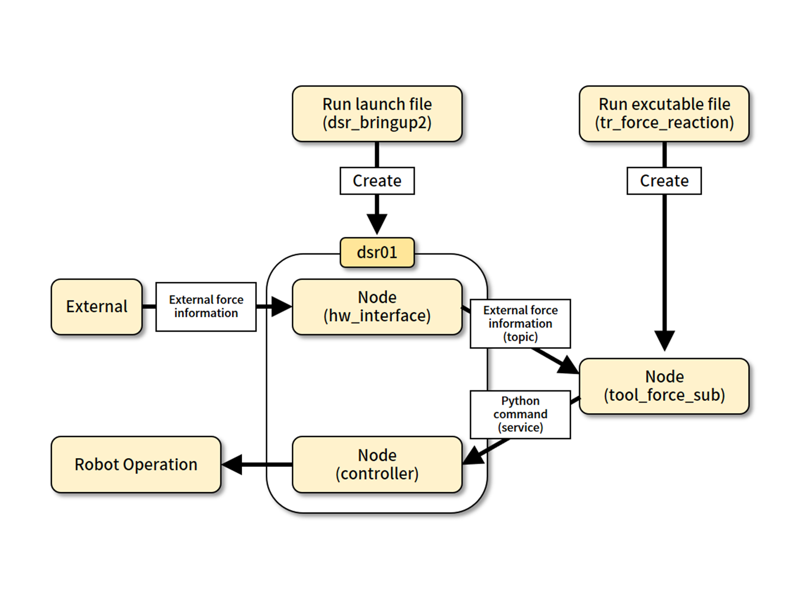
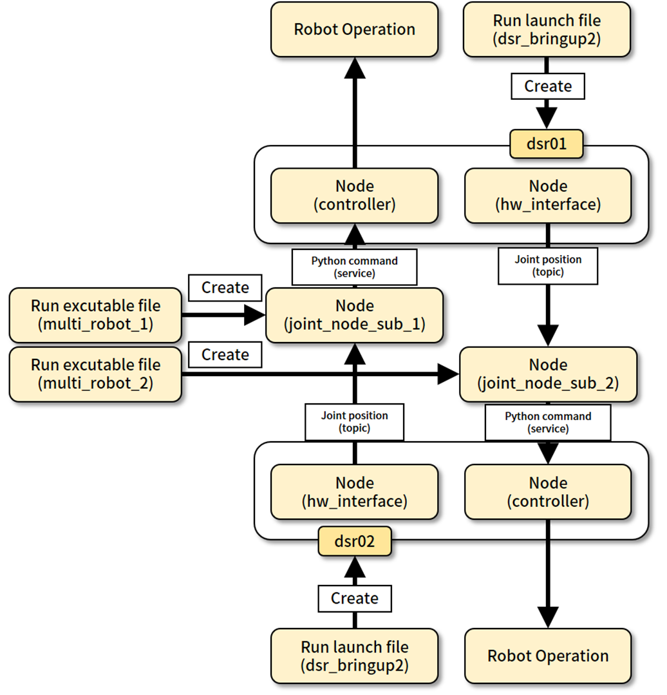
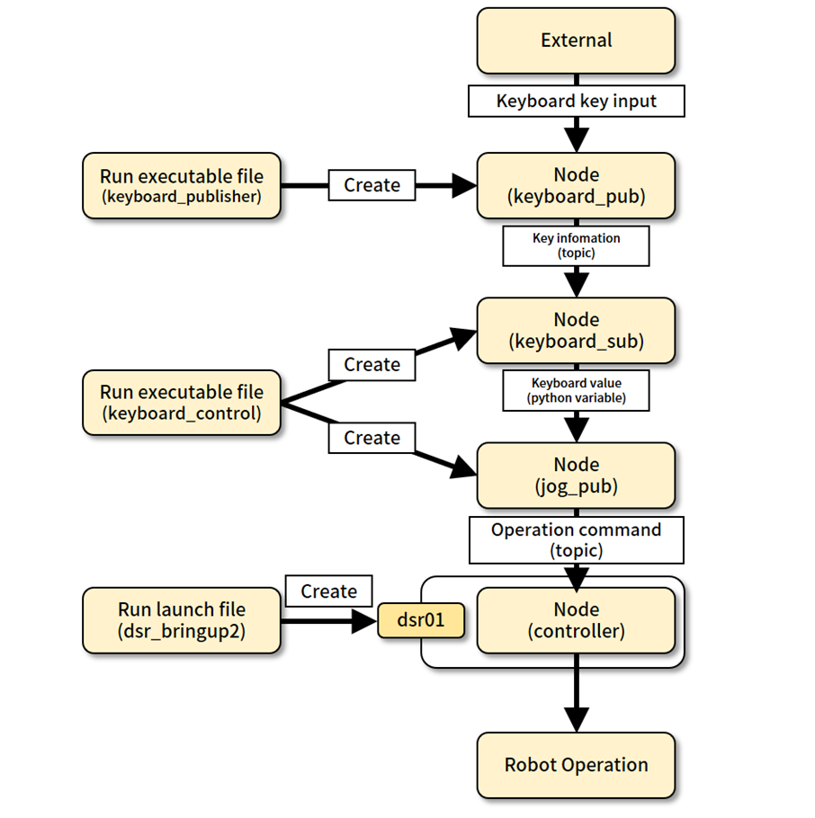

# <center>7. Training Examples</center>


<br/>

## Table of Contents
1. Force Monitoring 
2. Multi Robots 
3. Operation with Keyboard


<br/>

## 1) Force Monitoring 

```bash
# First terminal
$ ros2 launch dsr_bringup2 dsr_bringup2_rviz.launch.py model:=m0609 mode:=real name:=dsr01 host:=192.168.137.100 
```
```bash
# Second terminal
$ ros2 run edu_example force_reaction
```
```bash
# Third terminal
$ rqt
```


<center>Flow Chart - Force Monitoring</center>


<br/>

## 2) Multi Robots 

```bash
# First terminal
$ ros2 launch dsr_bringup2 dsr_bringup2_rviz.launch.py model:=m0609 mode:=real name:=dsr01 host:=192.168.137.100 
```
```bash
# Second terminal
$ ros2 launch dsr_bringup2 dsr_bringup2_rviz.launch.py model:=m0609 mode:=real name:=dsr02 host:=192.168.127.99
```
```bash
# Third terminal
$ ros2 run edu_example multi_robot_1
```
```bash
# Fourth terminal
$ ros2 run edu_example multi_robot_2
```


<center>Flow Chart - Multi Robots </center>


<br/>

## 3) Operation with Keyboard

```bash
# First terminal
$ ros2 launch dsr_bringup2 dsr_bringup2_rviz.launch.py model:=m0609 mode:=real name:=dsr01 host:=192.168.137.100
```
```bash
# Second terminal
$ ros2 run edu_example keyboard_control 
```
```bash
# Third terminal
$ ros2 run edu_example keyboard_publisher 
```


<center>Flow Chart - Operation with Keyboard</center>


