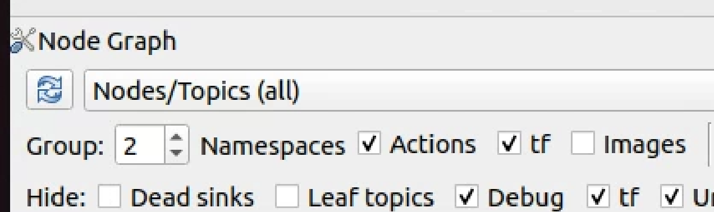
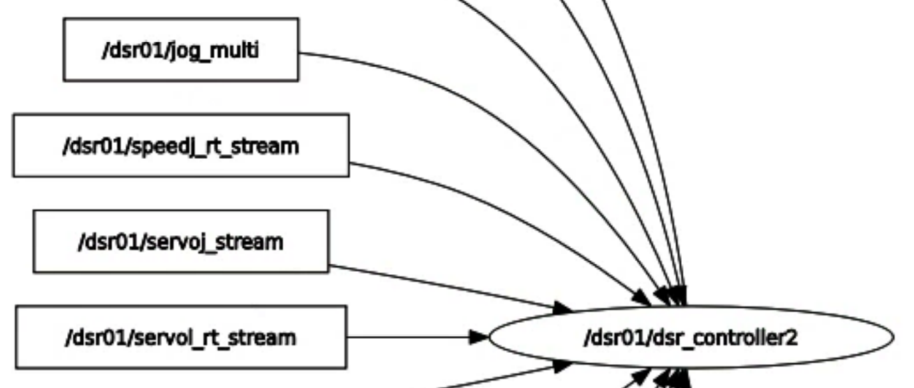

# <center>3. Method 1 : Using CLI</center>


<br/>

## Table of Contents
1. Service Request (move_joint)
2. Topic Publication (jog_multi)
3. Topic Subscription (current_posx)


<br/>

## Initial Setup
Move to the workspace and configure the ROS2 environment.<br/>
```bash
$ cd ~/ros2_ws # Default working directory<br/>
$ source /opt/ros/humble/local_setup.bash # Configure ROS 2 environment<br/>
$ source install/setup.bash # Configure user workspace environment<br/>
```
<br/>

As a precondition, activate the controller node of the robot.<br/>
```bash
$ ros2 launch dsr_bringup2 dsr_bringup2_rviz.launch.py
```


<br/><br/>
<!---------------------------------------------------------------->

# 1) Service Request
The Command Line Interface (CLI) is a method of sending commands via the terminal.<br/>
Using the terminal, you can interact directly with the robot by requesting services and subscribing to topics.<br/>
In this example, we will execute the "movej" command.<br/>
The basic CLI command syntax for requesting a service is as follows.<br/>
(service name, service type, arguments)<br/>
``` bash
$ ros2 service call [service_name] [service_type] [arguments]
```


<br/><br/>

## [service_name]
Enter the name of the service you want to request in [service_name].<br/>
You can check the available services with the following command.<br/>
``` bash
$ ros2 service list

/dsr01/aux_control/get_control_mode
/dsr01/aux_control/get_control_space
/dsr01/aux_control/get_current_posj
...
/dsr01/tool/set_current_tool
/dsr01/tool/set_tool_shape
```


> doosan-robot2/<br/>
> > dsr_msgs2/<br/>
> > > srv/<br/>
> > > > aux_control<br/>
> > > > drl<br/>
> > > > force<br/>
> > > > gripper<br/>
> > > > io<br/>
> > > > modbus<br/>
> > > > motion<br/>
> > > > realtime<br/>
> > > > system<br/>
> > > > tcp<br/>
> > > > tool<br/>
> <br/>


<center>Services provided by the Doosan Robotics ROS2 package</center>

<br/>

You can find only the services related to "motion" with the following command.<br/>
This allows you to confirm that the service name related to the movej command is /dsr01/motion/move_joint.<br/>

``` bash
$ ros2 service list | grep motion

/dsr01/motion/alter_motion
/dsr01/motion/change_operation_speed
/dsr01/motion/check_motion
...
/dsr01/motion/move_joint
/dsr01/motion/move_jointx
/dsr01/motion/move_line
...
/dsr01/motion/set_singularity_handling
/dsr01/motion/trans
```


<br/><br/>

## [service_type]
Now, using the following command, you can confirm that the service type is dsr_msgs2/srv/MoveJoint.

```bash
$ ros2 service type /dsr01/motion/move_joint

dsr_msgs2/srv/MoveJoint
```
<details>
<summary>Another way to find the service</summary>

Alternatively, you can use the following command to check the names and types of services at once.

```bash
$ ros2 service list -t | grep motion

/dsr01/motion/alter_motion [dsr_msgs2/srv/AlterMotion]
/dsr01/motion/change_operation_speed [dsr_msgs2/srv/ChangeOperationSpeed]
/dsr01/motion/check_motion [dsr_msgs2/srv/CheckMotion]
...
/dsr01/motion/move_joint [dsr_msgs2/srv/MoveJoint]
/dsr01/motion/move_jointx [dsr_msgs2/srv/MoveJointx]
/dsr01/motion/move_line [dsr_msgs2/srv/MoveLine]
...
/dsr01/motion/set_singularity_handling [dsr_msgs2/srv/SetSingularityHandling]
/dsr01/motion/trans [dsr_msgs2/srv/Trans]
```
</details>


<br/><br/>

## [arguments]
Through this process, we have determined the [service_name] and [service_type].<br/>
The next step is to understand the structure of the input [arguments] before calling the service.<br/>

You can refer to the source code of the Doosan Robotics ROS2 package or Github to find this information.

> doosan-robot2/<br/>
> > dsr_msgs2/<br/>
> > >srv/<br/>
> > > > motion<br/>
> > > > > MoveHome.srv<br/>
> > > > > MoveJoint.srv<br/>
> > > > > MoveJointx.srv<br/>
> <br/>
<center>File location: doosan-robot2/dsr_msgs2/srv</center><br/>

```bash
#____________________________________________________________________________________________
# move_joint  
# The robot moves to the target joint position (pos) from the current joint position.
#____________________________________________________________________________________________

float64[6] pos               # target joint angle list [degree] 
float64    vel               # set velocity: [deg/sec]
float64    acc               # set acceleration: [deg/sec2]
float64    time #= 0.0       # Time [sec] 
float64    radius #=0.0      # Radius under blending mode [mm] 
int8       mode #= 0         # MOVE_MODE_ABSOLUTE=0, MOVE_MODE_RELATIVE=1 
int8       blend_type #= 0    # BLENDING_SPEED_TYPE_DUPLICATE=0, BLENDING_SPEED_TYPE_OVERRIDE=1
int8       sync_type #=0      # SYNC = 0, ASYNC = 1
---
bool success
```
<center>Structure of arguments (MoveJoint.srv)</center><br/>


<br/><br/>

## 명령어
Now that we have identified the structure of the input [arguments], we can construct the service request command.<br/>
In this example, we will request the service to move the joint angles to [0, 0, 90, 0, 90, 0].<br/>
(Note that arguments are written using the YAML syntax.)<br/>

```bash
[service_name] : /dsr01/motion/move_joint
[service_type] : dsr_msgs2/srv/MoveJoint
[arguments] : "{pos: [0, 0, 90, 0, 90, 0], vel: 60, acc: 60}"

$ ros2 service call [service_name] [service_type] [arguments]
$ ros2 service call /dsr01/motion/move_joint dsr_msgs2/srv/MoveJoint "{pos: [0, 0, 90, 0, 90, 0], vel: 60, acc: 60}"
```

> <br/>
> <center>영상</center>
> <br/>

<center>Example video of service call</center><br/>

<br/>

<details>
<summary>How to check detailed service information</summary>

<br/>

You can check which node handles the service request and response.<br/>
Use the following command to see if any node handles the service "/dsr01/motion/move_joint".<br/>

``` bash
$ for node in $(ros2 node list)
$ do
$ echo "Checking node: $node"
$ ros2 node info $node | grep '/dsr01/motion/move_joint' && echo " -> found in $node"
$ done

Checking node: /dsr01/connection_node
Checking node: /dsr01/controller_manager
Checking node: /dsr01/dsr_controller2
/dsr01/motion/move_joint: dsr_msgs2/srv/MoveJoint
/dsr01/motion/move_jointx: dsr_msgs2/srv/MoveJointx
-> found in /dsr01/dsr_controller2
Checking node: /dsr01/dsr_hw_interface2
Checking node: /dsr01/dsr_hw_interface_update
Checking node: /dsr01/robot_state_publisher
Checking node: /dsr01/rviz2
```

<br/>

We can see that the node "/dsr01/dsr_controller2" handles the service "/dsr01/motion/move_joint".<br/>
By examining the node's information with the following command, we can confirm that this node is the service server for "/dsr01/motion/move_joint".<br/>

``` bash
$ ros2 node info /dsr01/dsr_controller2

/dsr01/dsr_controller2
Subscribers:
/dsr01/alter_motion_stream: dsr_msgs2/msg/AlterMotionStream
...
/parameter_events: rcl_interfaces/msg/ParameterEvent
Publishers:
/dsr01/dsr_controller2/transition_event: lifecycle_msgs/msg/TransitionEvent
...
/rosout: rcl_interfaces/msg/Log
Service Servers:
/dsr01/aux_control/get_control_mode: dsr_msgs2/srv/GetControlMode
...
/dsr01/motion/move_joint: dsr_msgs2/srv/MoveJoint # 해당 서비스의 서비스 서버임을 확인할 수 있습니다.
...
/dsr01/tool/set_tool_shape: dsr_msgs2/srv/SetToolShape
Service Clients:

Action Servers:

Action Clients:

```
</details>


<br/><br/>

# 2) Topic Publication

Similar to sending commands to the robot through service requests, we can also publish topics.<br/>
In this example, we will publish a topic to send a jog command to the robot.<br/>
The difference from a service request is the publication rate [rate].<br/>

If you enter --once at the [rate] location, the topic is published once. If you enter --rate 1, it is published once per second.<br/>
(The number corresponds to Hz, defining how many times per second the topic is published.)<br/>
(publication rate, topic name, topic type, arguments)<br/

```bash
$ ros2 topic pub [rate] [topic_name] [topic_type] [arguments]
```


<br/><br/>

## [topic_name]

```bash
1 $ ros2 topic list
2
3 /clicked_point
4 /dsr01/alter_motion_stream
5 /dsr01/dsr_controller2/joint_trajectory
6 ...
7 /dsr01/jog_multi
8 ...
9 /tf
10 /tf_static
11
```


<br/><br/>

## [topic_type]

```bash
$ ros2 topic type /dsr01/jog_multi

dsr_msgs2/msg/JogMultiAxis
```

<details>
<summary>Another way to find the topic</summary>

Alternatively, you can use the following command to check the names and types of topics at once.

``` bash
$ ros2 topic list -t

/clicked_point [geometry_msgs/msg/PointStamped]
/dsr01/alter_motion_stream [dsr_msgs2/msg/AlterMotionStream]
/dsr01/dsr_controller2/joint_trajectory [trajectory_msgs/msg/JointTrajectory]
...
/dsr01/jog_multi [dsr_msgs2/msg/JogMultiAxis]
...
/tf [tf2_msgs/msg/TFMessage]
/tf_static [tf2_msgs/msg/TFMessage]

```
</details>


<br/><br/>

## [arguments]

> doosan-robot2/<br/>
> > dsr_msgs2/<br/>
> > >msg/<br/>
> > > > motion<br/>
> > > > > AlterMotionStream.msg<br/>
> > > > > JogMultiAxis.msg<br/>
> > > > > . . .<br/>
> <br/>
<center>File location: doosan-robot2/dsr_msgs2/msg</center><br/>

```bash
#____________________________________________________________________________________________
# multi jog
# multi jog speed = (250mm/s x 1.73) x unit vecter x speed [%] 
#____________________________________________________________________________________________

float64[6]  jog_axis          # unit vecter of Task space [Tx, Ty, Tz, Rx, Ry, Rz] : -1.0 ~ +1.0 
int8        move_reference    # 0 : MOVE_REFERENCE_BASE, 1 : MOVE_REFERENCE_TOOL, 2 : MOVE_REFERENCE_WORLD
float64     speed             # jog speed [%]

```
<center>Structure of arguments (JogMultiAxis.msg)</center><br/>


<br/><br/>

## Command
Now that we have identified the structure of the input [arguments], we can construct the topic publication command.<br/>
(Note that arguments are written using the YAML syntax.)<br/>
In this example, we will publish a topic to jog the robot in the x-axis direction of the Task coordinate system.<br/>

``` bash
[topic_name] : /dsr01/jog_multi
[topic_type] : dsr_msgs2/msg/JogMultiAxis
[arguments] : "{jog_axis: [1,0,0,0,0,0], move_reference: 0, speed: 50}"

$ ros2 topic pub [rate] [topic_name] [topic_type] [arguments]
$ ros2 topic pub --once /dsr01/jog_multi dsr_msgs2/msg/JogMultiAxis "{jog_axis: [[1,0,0,0,0,0]], move_reference: 0, speed: 50}"
```

> <br/>
> <center>영상</center>
> <br/>

<br/>

<center>Example video of topic publication</center><br/>


<br/>


<details>
<summary>How to check detailed topic information (Method 1)</summary>

<br/>

You can check which node is subscribing to the topic.<br/>
First, check the information of the topic "/dsr01/jog_multi" to know 1) the type of the topic and 2, 3) the number of nodes that publish and subscribe to the topic.

```bash
$ ros2 topic info /dsr01/jog_multi

Type: dsr_msgs2/msg/JogMultiAxis
Publisher count: 0
Subscription count: 1
```

<br/>

Check which node handles the topic "/dsr01/jog_multi" with the following command.

```bash
$ for node in $(ros2 node list)
$ do
$   echo "Checking node: $node"
$   ros2 node info $node | grep '/dsr01/jog_multi' && echo " -> found in $node"
$ done

Checking node: /dsr01/connection_node
Checking node: /dsr01/controller_manager
Checking node: /dsr01/dsr_controller2
    /dsr01/jog_multi: dsr_msgs2/msg/JogMultiAxis
    -> found in /dsr01/dsr_controller2
Checking node: /dsr01/dsr_hw_interface2
Checking node: /dsr01/dsr_hw_interface_update
Checking node: /dsr01/robot_state_publisher
Checking node: /dsr01/rviz2
```

<br/>

We can see that the node "/dsr01/dsr_controller2" handles the topic "/dsr01/jog_multi".<br/>
By examining the node's information with the following command, we can confirm that this node is subscribing to the topic "/dsr01/jog_multi".<br/>

```bash
$ ros2 node info /dsr01/dsr_controller2

/dsr01/dsr_controller2
Subscribers:
/dsr01/alter_motion_stream: dsr_msgs2/msg/AlterMotionStream
/dsr01/jog_multi: dsr_msgs2/msg/JogMultiAxis # 해당 토픽을 구독하는 것을 확인할 수 있습니다.
...
/parameter_events: rcl_interfaces/msg/ParameterEvent
Publishers:
/dsr01/dsr_controller2/transition_event: lifecycle_msgs/msg/TransitionEvent
...
/rosout: rcl_interfaces/msg/Log
Service Servers:
/dsr01/aux_control/get_control_mode: dsr_msgs2/srv/GetControlMode
...
/dsr01/tool/set_tool_shape: dsr_msgs2/srv/SetToolShape
Service Clients:

Action Servers:

Action Clients:

```
</details>


<br/>

<details>
<summary>How to check detailed topic information (Method 2)</summary>

<br/>

You can check the connection status between nodes using the comprehensive GUI tool of ROS, RQt with rqt_graph.
Through this, you can see the node "/dsr01/dsr_controller2" subscribing to the topic "/dsr01/jog_multi".

```bash
$ rqt_graph
```

<br/><br/>


<br/>
<br/>
<p align="center">
  
</p>

<center>How to configure rqt_graph</center>
<center>(If the graph does not appear, click the arrow-shaped refresh button.)</center>

<br/><br/>


<br/>
<br/>
<p align="center">
  
</p>

<center>Node "/dsr01/dsr_controller2" subscribing to the topic "/dsr01/jog_multi"</center>
<center>Square: topic / Circle: node</center>
</details>


<br/><br/>

# 3) Topic Subscription

You can subscribe to topics published by currently running nodes using CLI commands to check information.
In this example, we will subscribe to the topic that indicates the current position value of the robot TCP.
The command to subscribe to a topic is as follows. (topic name)

```bash
$ ros2 topic echo [topic_name]
```


<br/><br/>

## [topic_name]

```bash
$ ros2 topic list

/clicked_point
/dsr01/alter_motion_stream
/dsr01/dsr_controller2/joint_trajectory
…
/dsr01/msg/current_posx
…
/tf
/tf_static
```


<br/><br/>

## 명령어

```bash
[topic_name] : /dsr01/msg/current_posx

$ ros2 topic echo [topic_name]
$ ros2 topic echo /dsr01/msg/current_posx
```

> <br/>
> <center>영상</center>
> <br/>
